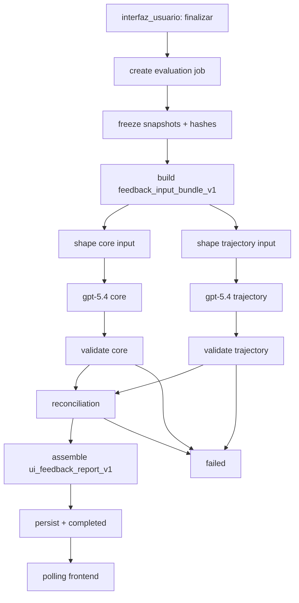

# 02 — Arquitectura

## Principios rectores

1. Eval-driven desde el diseño (contratos, datasets, provenance).
2. Structured outputs strict por runner.
3. Workflow multi-etapa (sin LLM monolítica).
4. Separación análisis/presentación.
5. Primacía del diálogo como fuente de evaluación.
6. Integración aditiva sin tocar núcleo de negociación en caliente.

## Decisiones arquitectónicas v1 cerradas

- Dos salidas LLM: `feedback_report_core_v1` y `turn_trajectory_v1`.
- Ensamblado backend a `ui_feedback_report_v1`.
- Jobs con estado y polling.
- Modelos v1: `gpt-5.4` para ambos runners.
- Persistencia v1 in-memory detrás de repositorio abstracto.

## Capas

- **Engine evaluación** (genérico): jobs, runners, validación, reconciliación, ensamblado, provenance.
- **Dominio negociación**: extractor/facts + rúbrica JSON (`domains/negotiation/rubrics/`) + loader reutilizable.
- **API/UI**: create-status-report + modal/loading/report.

## Diagrama E2E

## Garantía de no-ruptura

- no se modifica `run_negotiation_cognitive_turn`,
- no se cambia contrato de `/api/interfaz_usuario/negociacion/turn`,
- no se persiste informe en `CanonicalState`,
- endpoints de evaluación aislados bajo `/api/interfaz_usuario/feedback/*`.
